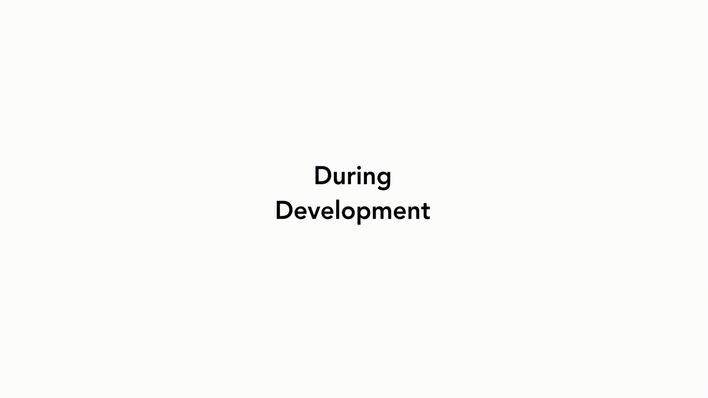
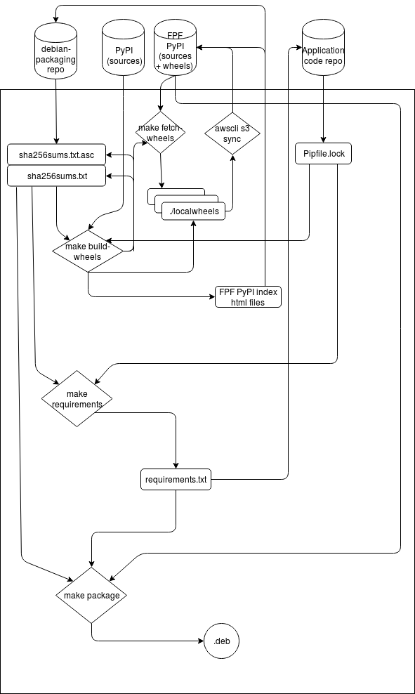

# SecureDrop Debian Packaging

[](https://circleci.com/gh/freedomofpress/securedrop-debian-packaging/tree/master)

This repository contains the packaging files and tooling for building Debian packages for projects for the alpha [SecureDrop Workstation](https://github.com/freedomofpress/securedrop-workstation) based on Qubes OS. Packages are placed on `apt-test-qubes.freedom.press` for installation in Debian-based TemplateVMs. These packages are not yet ready for use in a production environment.

## Packaging a Python-based SecureDrop project

The following process is used for Python-based projects for the Qubes SecureDrop Workstation, namely, `securedrop-proxy` and `securedrop-client`:



The following diagram shows the makefile targets/scripts in this repository, the produced artifacts and the locations where these artifacts are stored:



### Packaging Dependencies

In a Debian AppVM in Qubes:

```
make install-deps
make fetch-wheels
```

## Updating Python wheels

Maintainers of `securedrop-client` and `securedrop-proxy` must ensure that
the requirements files which are used for build of these packages (`build-requirements.txt`)
using `make requirements` are kept up to date in latest `master` of those repositories.

If new dependencies were added in the `requirements.txt` of that
repo that are not in the FPF PyPI mirror, then the maintainer needs
to do the following (we are taking `securedrop-client` project as example):

### 1. Sync the wheels locally

Sync all of the latest wheels `make fetch-wheels`

### 2. Create updated build-requirements.txt for the project

From the `securedrop-debian-packaging` directory,

```
PKG_DIR=/home/user/code/securedrop-client make requirements
```

This will create the proper `requirements.txt` file in the project directory along with the binary wheel
hashes from our own Python package index server.

If we are missing any wheels from our cache/build/server, it will let you know with a following message.

```
The following dependent wheel(s) are missing:
pytest==3.10.1

Please build the wheel by using the following command.
	PKG_DIR=/home/user/code/securedrop-client make build-wheels
Then sync the newly built wheels and sources to the s3 bucket.
Also update the index HTML files accordingly and sync to s3.
After these steps, please rerun the command again.
```

So, the next step is to build the wheels. To do this step, you will need the
GPG key of @kushaldas and @conorsch @redshiftzero @emkll on the same user as
the actual list of hashes will be signed by one of us.


```shell
PKG_DIR=/home/user/code/securedrop-client make build-wheels
```

This above command will let you know about any new wheels+sources. It will
build/download sources from PyPI (by verifying it against the sha256sums from
the `Pipfile.lock` of the project).

Then navigate back to the project's code directory and run the following command.

```bash
python3 setup.py sdist
```


### 3. Sync the localwheels directory back to the s3 bucket. (if only any update of wheels)

This has to be manual step for security reasons. In future all of these wheel
building steps should be done by a different system, not with the devloper's
laptop.

```
cd localwheels/
aws s3 sync . s3://dev-bin.ops.securedrop.org/localwheels/
```

### 4. Update the index files for the bucket (required for Debian builds)

If there is any completely new Python package (source/wheel), then only we will have to update our index.

```
./scripts/createdirs.py ~/code/securedrop-client/requirements.txt
```
Then update the corresponding packages's `index.html`.

If there is a new package, then update the main index.

```
./scripts/updateindex.py
```

Finally sync the index.

```
cd simple/
s3 sync . s3://dev-bin.ops.securedrop.org/simple/
```

## Make a release

Summarizing release manager steps:

1. Update versions as necessary
2. Do a test build following steps below
3. Make any changes as necessary and create a PR into the repository to be packaged with the modifications from steps 1-3
4. Push the release tag for use in building

## Build a package

Next, checkout the project you intend to package and enter that directory:

```
git clone git@github.com:freedomofpress/securedrop-foobar.git
cd securedrop-foobar
```

Checkout the release tag for the project:

```
git checkout 0.x.y
```

Generate a tarball to be used in the build process:

```
python3 setup.py sdist
```

Clone this repository for access to the packaging tooling.

```
cd ..
git clone git@github.com:freedomofpress/securedrop-debian-packaging.git
cd securedrop-debian-packaging
```

If you are releasing a new version (rather than rebuilding a package from a previous version),
you must update the changelog:

```
./scripts/update-changelog securedrop-foobar
```

Finally, build the package by pointing to the tarball and package version:

```
PKG_PATH=/path/to/tarball PKG_VERSION=0.x.y make securedrop-foobar
```

## Packaging non-Python based SecureDrop projects

TODO

## Intro to packaging

For an introduction to packaging Python projects into Debian packages, one can see the [SecureDrop Debian Packaging Guide](https://securedrop-debian-packaging-guide.readthedocs.io/en/latest/). Note that these guidelines on Read the Docs are for educational purposes only. The README you are currently reading is the canonical reference for SecureDrop Workstation packagers. 

